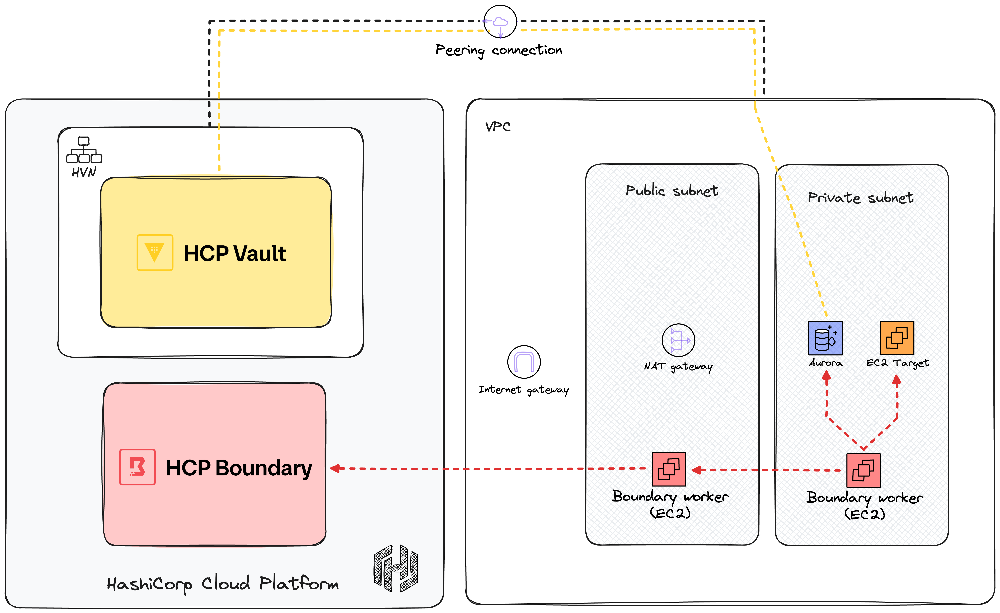

# HashiTalks Secure 2024

> This is the accompanying repository for my session **Unlocking Privileged Access Management: HCP Boundary with Terraform** from [HashiTalks Secure 2024](https://events.hashicorp.com/hashitalkssecure).
>
> The setup of my exact demo scenario has many prerequisites for it to be successful (especially things related to Entra ID). You should use this repository as a helpful example to how things are set up in Boundary using Terraform, but you will need to make adjustments for your particular environment.
>
> Note that this repository is in fact a copy of the repository I use in the talk. The real repository is part of a GitHub organization where I have set up SSO with Entra ID. That is another crucial part that needs to be in place for the demo. Setting that up is beyond the scope of my talk.

This repository contains sample Terraform configuration for setting up HCP Boundary with HCP Vault for securely accessing resources in AWS.

## Summary

This sample sets up a VPC in AWS with a public and a private subnet. The private subnet contains an EC2 instance and a serverless Aurora cluster, both will be targets in Boundary. A Boundary worker EC2 instance is deployed in each subnet. In HCP, a Boundary cluster and a Vault cluster is configured. The HCP Vault cluster is placed in a HVN that is peered with the AWS VPC to provide private access to Vault from AWS.

To access the targets in the private subnet Boundary uses multi-hop connections where the traffic goes through both of the workers. The worker in the public subnet acts as an ingress worker, and the worker in the private subnets acts as an egress worker. Vault is set up to inject and broker required credentials to access the targets.

A high-level overview the infrastructure is shown below:

The yellow dashed line indicates private traffic to and from Vault over the peering connection. The red dashed arrows indicates the connection direction for Boundary workers.

Most features of Boundary is present in this sample (as of May 2024) including:

- workers
- auth-methods, managed groups, users, accounts, roles
- scopes
- session recordings and storage policies
- credential stores, and credential libraries (using both Vault and Boundary)
- host catalogs, host sets, hosts (however, not dynamic host sets)
- targets and aliases (new in Boundary 0.16)
